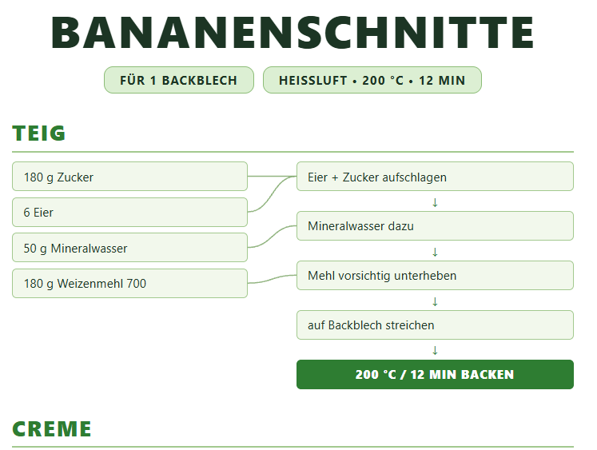

# ReadableRecipes

Are you annoyed at scrolling in recipes between instructions and ingredients?
Fear no more with this very practical display of recipes!
It is print friendly and the recipes are based in json:

```json
{
  "title": "BANANENSCHNITTE",
  "band": ["FÜR 1 BACKBLECH", "HEISSLUFT • 200 °C • 12 MIN"],
  "sections": [
    {
      "name": "TEIG",
      "ingredients": ["180 g Zucker", "6 Eier"],
      "steps": [
        { "text": "Eier + Zucker aufschlagen", "uses": [1, 0] },
        "auf Backblech streichen",
        { "text": "BACKEN", "bold": true }
      ]
    }
  ]
}
```

=> 

## How it works

`render.py` reads every file in `recipes/` and renders it into `recipes_rendered/<name>.html` using `template.html`. Each section shows the ingredients on the left and the steps on the right. Steps that use ingredients get connector lines to the matching ingredient boxes.

Run:

```
py render.py
```

The renderer uses the Python standard library only.

## Recipe format

- `title`, `band`: poster header text.
- `sections`: list of named sections.
- Each section has `ingredients` (list) and `steps` (list).
- An item is a string, or an object with `text`, optional `bold` (highlight), and optional `uses` (indexes of the ingredients the step uses).

## Tests

```
.\scripts\run_tests.ps1
```

The script runs pytest in the workspace venv (`venv`). Create it first with `python -m venv venv` and install `requirements.txt` (test-only: `pytest`, `approvaltests`).
